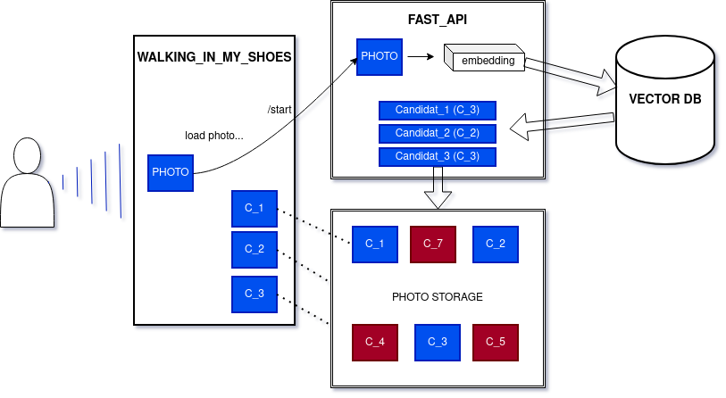
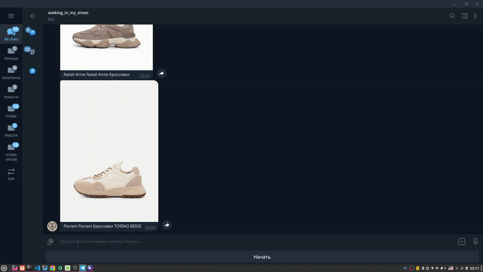
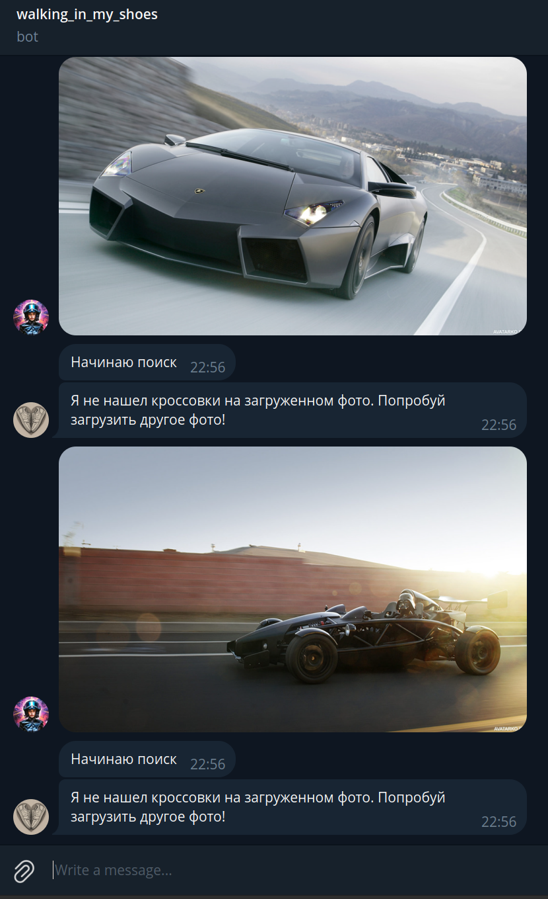

<h1 align="center">SneakerSearch</h1>

***
***

**Сервис для поиска похожих кроссовок**

<p align="center">

</p>

Структура сервиса состоит из:

    - бэкенд на FastAPI. 

        Эндпоинт /helthcheck для проверки состояния сервиса

        Эндпоинт /search непосредственно реализует логику поиска 

    - векторная база данных Qdrant

    - телеграмм-бот для взаимодействия пользователя с сервисом. Пользователь загружает фото, сервис возвращает 3 наиболее похожие модели.

<p align="center">
  
</p>

В случае загрузки фотографии, не содержащей изображение кроссовок, сервис выдает сообщение, о том, что кроссовки не найдены и просьбу загрузить другое фото:

<p align="center">

</p>

***
***

Сервис разворачивается командой 
```
docker compose up
```

* Сначала поднимается **init контейнер**, который скачивает снапшот коллекции для Qdrant и веса для дообученной модели Mobilenet.

* Далее поднимается **ВБД Qdrant**, которая загружает коллекцию из скачанного снапшота и ждет успешного healthcheck'а

* После Qdrant стартует **бэкенд**, который разворачивает FastAPI сервер на 8000 порту

* Последним поднимается **телеграм-бот**

Последовательность старта контейнеров строго определяется depends_on. Чувствительные данные передаются через переменные окружения.

